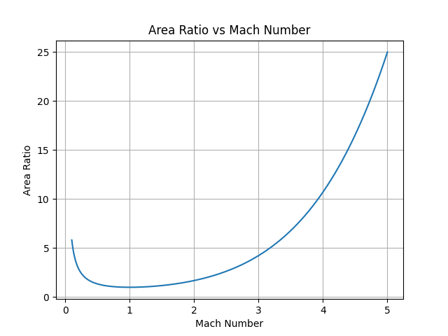

# Rocket Nozzle Design Study

## Overview

This repository contains Python code for studying the variation of Mach number with nozzle area ratio in convergent and convergent-divergent (CD) rocket nozzles using compressible flow relations.

The project focuses on analyzing isentropic nozzle flow behavior and plotting the relationship between area ratio and Mach number for both subsonic and supersonic flow regions.

---

## Objectives

- Study compressible flow behavior in rocket nozzles
- Understand convergent and convergent-divergent nozzle flow
- Plot Area Ratio vs Mach Number graph
- Analyze subsonic and supersonic nozzle flow regions
- Apply isentropic flow relations in aerospace propulsion

---

## Theory

In compressible flow through rocket nozzles, the Mach number varies with nozzle cross-sectional area according to the isentropic area-Mach relation.

For a convergent-divergent nozzle:

- Subsonic flow accelerates in the convergent section
- Flow reaches Mach 1 at the throat
- Supersonic flow develops in the divergent section

This relationship is fundamental in rocket propulsion and nozzle design.

---

## Governing Equation

The isentropic area-Mach relation is given by:

$$
\frac{A}{A^*}=
\frac{1}{M}
\left[
\frac{2}{\gamma+1}
\left(
1+\frac{\gamma-1}{2}M^2
\right)
\right]^{\frac{\gamma+1}{2(\gamma-1)}}
$$

Where:

- \( A \) = Local nozzle area
- \( A^* \) = Throat area
- \( M \) = Mach number
- \( \gamma \) = Ratio of specific heats

---

## Tools and Technologies Used

- Python
- NumPy
- Matplotlib
- VS Code
- GitHub

---

## Output

The project generates:

- Area Ratio vs Mach Number graph
- Subsonic flow region analysis
- Supersonic flow region analysis

---

## Project Files

- `Rocket_Nozzle.py` → Main Python code
- `Rocket_Nozzle_AreaRatioVsMachNo_Fig.png` → Generated graph
- `README.md` → Project documentation

---

## Sample Output Graph

---

## Applications

This project is useful for:

- Rocket nozzle design
- Aerospace propulsion studies
- Compressible flow analysis
- CFD pre-analysis studies
- Aerospace engineering academic projects

---

## Future Improvements

Possible future extensions of this project include:

- Pressure ratio analysis
- Temperature variation analysis
- Exit velocity calculations
- Thrust coefficient calculations
- CFD validation using ANSYS or XFLR5
- Bell nozzle geometry analysis

---

## Author

Prarthana Pradhan

B.Tech Aerospace Engineering Student

---

## License

This project is intended for educational and academic purposes.
